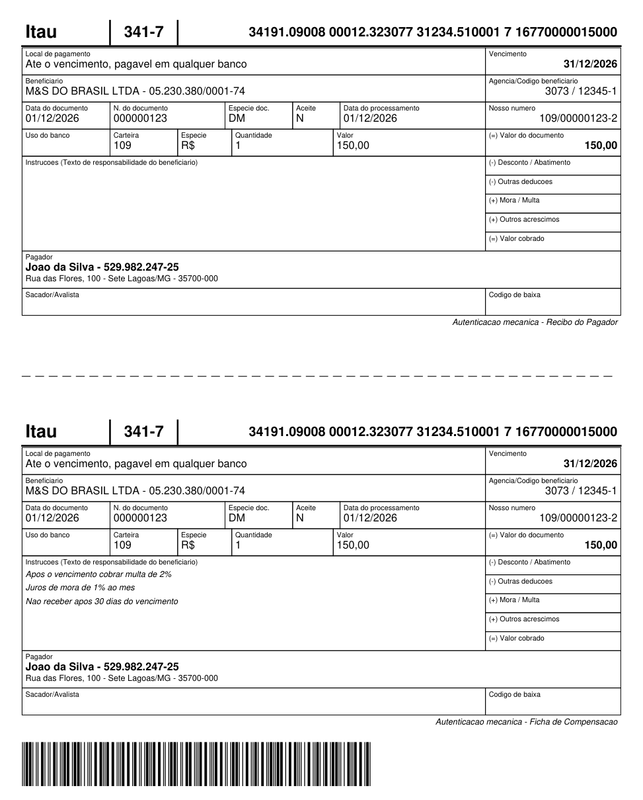

# PL_FPDF

<p align="center">
  
  
  <a href="LICENSE"></a>
  
  <a href="https://github.com/Maxwbh/pl_fpdf/actions/workflows/ci.yml"></a>
  <a href="https://github.com/Maxwbh/pl_fpdf/releases"></a>
  <a href="https://github.com/Maxwbh/pl_fpdf/stargazers"></a>
</p>

<p align="center">
  <b>Pure PL/SQL PDF Generation & Manipulation Library</b>
</p>

<p align="center">
  <a href="#installation">Installation</a> •
  <a href="#quick-start">Quick Start</a> •
  <a href="#features">Features</a> •
  <a href="#documentation">Docs</a> •
  <a href="README.md">🇧🇷 Português (principal)</a>
</p>

A PDF library that runs **inside Oracle Database**: two PL/SQL packages, no
Java, no external service, no database object beyond them. It generates and
also **manipulates** — load, merge, split, watermark, and **protect with
passwords and AES-256 encryption**.

The full public surface is in
[`docs/API_REFERENCE_EN.md`](docs/API_REFERENCE_EN.md), maintained by
[@Maxwbh](https://github.com/Maxwbh) since 2019: PDF manipulation (v3.0), PDF 1.5+ reading with cross-reference and
object streams, AES-256/AES-128/RC4, QR codes and barcodes, DEFLATE and INFLATE
written in PL/SQL, UTF-8/TrueType and Oracle 19c/23c.

> **Lineage.** The generation core descends from the PL/SQL port by
> [Pierre-Gilles Levallois](https://github.com/Pilooz), who brought Olivier
> Plathey's [FPDF](http://www.fpdf.org/) to Oracle. That is where the API you
> may already know comes from — `Cell`, `AddPage`, `SetFont`, `MultiCell`. On
> top of it, this project added new APIs without removing a single original
> one. Full credits at the bottom of this page.
>
> This document is a secondary translation. The canonical, most complete README is
> [**README.md**](README.md) (Portuguese — Brazil).

---

## Why PL_FPDF?

Generate and manipulate PDFs **directly in Oracle Database** - no Java, no external services, no middleware.

| Need | Solution |
|------|----------|
| Create reports from Oracle | Pure PL/SQL - runs inside the database |
| Modify existing PDFs | Load, edit, merge, split - all in PL/SQL |
| Protect documents | AES-256, AES-128 or RC4 encryption with permissions |
| Zero dependencies | No OWA, no OrdImage, no external libs |
| Simple deployment | Two packages, no database objects: `PL_FPDF_UTIL` then `PL_FPDF` |
| Brazilian market | Optional extension for **PIX** (EMV QR code) and **Boleto** (FEBRABAN) |

---

## Installation

**One file, no clone.** Download
[`dist/pl_fpdf_install.sql`](dist/pl_fpdf_install.sql) — the link follows the
branch you are looking at; the published stable version is the one on
[`master`](https://raw.githubusercontent.com/Maxwbh/pl_fpdf/master/dist/pl_fpdf_install.sql).
Open it in the PL/SQL Developer SQL Window (F8) — or run `@pl_fpdf_install.sql`
in SQL\*Plus / SQLcl — and you are done. It carries both packages in dependency
order, and it is plain SQL: no tool-specific commands, no table, sequence or
directory to create first.

```sql
-- If you would rather install from the clone, the utility comes FIRST:
-- PL_FPDF calls PL_FPDF_UTIL, and the reverse order leaves the former invalid.
@src/PL_FPDF_UTIL.pks
@src/PL_FPDF_UTIL.pkb
@src/PL_FPDF.pks
@src/PL_FPDF.pkb

-- Verify
SELECT PL_FPDF.co_version FROM DUAL;
-- Returns: 3.2.0
```

**Requirements:** Oracle 19c+, and `CREATE PROCEDURE` in the schema where the
packages will live. Nothing else — in particular, **no**
`GRANT EXECUTE ON SYS.DBMS_CRYPTO` is needed.

**No external dependencies, not even for encryption.** `EncryptPDF`/`DecryptPDF` use MD5 and SHA via `STANDARD_HASH` (native SQL functions); RC4 and AES are implemented in the package itself.

---

## Quick Start

```sql
DECLARE
  l_pdf BLOB;
BEGIN
  PL_FPDF.Init('P', 'mm', 'A4');
  PL_FPDF.AddPage();
  PL_FPDF.SetFont('Arial', 'B', 16);
  PL_FPDF.Cell(0, 10, 'Hello World!', '0', 1, 'C');

  l_pdf := PL_FPDF.OutputBlob();          -- the PDF, in memory

  -- From here it is yours: store it, send it, serve it.
  INSERT INTO documents (name, pdf) VALUES ('hello.pdf', l_pdf);
  -- or PL_FPDF.OutputFile('hello.pdf', 'PDF_DIR');   straight to a DIRECTORY
  -- or serve it to a browser — see "Entregar o PDF a um navegador"
  --    in docs/DOCUMENTATION.md
END;
```

**Arial maps to Helvetica**, as in FPDF: to the library they are the same
typeface. The examples use both names; pick one and stay with it.

### Showcase: the layout of a Brazilian bank slip, drawn in PL/SQL

<p align="center">
  
</p>

<p align="center"><sub>
  Actual output of <code>examples/boleto.sql</code>, produced inside Oracle and
  verified here: zxing reads all 44 barcode digits off the rendered PDF.
</sub></p>

An easy document is a page with a heading. What actually shows what the library
can do is the **layout of a boleto bancário** (Brazilian bank slip) — and it
comes out of the database whole, with no images at all:

| Item | Detail |
|---|---|
| Page | A4 portrait, with the **177 mm** payment slip centred on it |
| Fonts | three Helvetica variants (regular, bold, italic) in four sizes |
| Grid | **50 boxes** placed to the millimetre, in two copies, with a cut line |
| Alignment | a 40 mm value column, with the money **right-aligned** |
| Barcode | **44-digit ITF** — the one a bank scanner actually reads |
| Images | **none**: logo, rules and bars are all vector drawing |

> **PL_FPDF draws; it does not compute billing.** The 44 barcode digits and the
> digitable line arrive **ready**, like any other value you pass in. Building
> them from bank, due date, amount and free field — check digits, due-date
> factor, each bank's own rules — belongs to a billing project, not to a PDF
> library.

```sql
-- one field of the slip: small label on top, value underneath.
-- Cell already applies a 1 mm inner margin on both sides, so the width passed
-- in is the whole box — right-aligned text lands 1 mm from the border.
PROCEDURE campo(px NUMBER, py NUMBER, pw NUMBER, ph NUMBER,
                protulo VARCHAR2, pvalor VARCHAR2 DEFAULT NULL,
                pneg BOOLEAN DEFAULT FALSE, palin VARCHAR2 DEFAULT 'L') IS
BEGIN
  PL_FPDF.Rect(px, py, pw, ph, 'D');
  PL_FPDF.SetFont('Arial', '', 6);
  PL_FPDF.SetXY(px, py + 0.7);
  PL_FPDF.Cell(pw, 2.4, protulo, '0', 0, 'L');
  IF pvalor IS NOT NULL THEN
    PL_FPDF.SetFont('Arial', CASE WHEN pneg THEN 'B' END, 9);
    PL_FPDF.SetXY(px, py + 3.2);
    PL_FPDF.Cell(pw, 3.4, pvalor, '0', 0, palin);
  END IF;
END campo;

-- ...and the slip barcode, 103 x 13 mm as the Brazilian standard requires
PL_FPDF.AddBarcode(16.5, 233, 103, 13,
                   '34197167700000150001090000012323073123451000',
                   'ITF', FALSE);
```

📄 **[Complete, runnable example: `examples/boleto.sql`](examples/boleto.sql)**

The same applies to any tight-grid form: invoices, tax forms, contracts with
fields, registration sheets. What the example shows is **millimetre-accurate
positioning** with the library's own primitives.

### And its colourful sibling: an event ticket

<p align="center">
  
</p>

<p align="center"><sub>
  Actual output of <code>examples/ticket.sql</code>, produced inside Oracle and
  verified here: zxing reads both the QR and the Code 39, and they carry the
  same code.
</sub></p>

The bank slip proves the grid. [`examples/ticket.sql`](examples/ticket.sql)
proves the rest — and neither uses a single image:

| Item | Detail |
|---|---|
| Colour | filled header band, **white text on top of it**, grey panels with white cores |
| Two symbols | **QR Code and Code 39 on the same page**, carrying the same code |
| Multi-page | one ticket per page, each with its own attendee and code |
| Free shape | the speech-bubble tail, via `Poly` — not everything is a rectangle |

```sql
-- coloured panel, and the title in white on top of it
PL_FPDF.SetFillColor(13, 25, 44);
PL_FPDF.Rect(12, 13.5, 186, 36, 'F');

PL_FPDF.SetTextColor(255, 255, 255);
PL_FPDF.SetFont('Arial', 'B', 17);
PL_FPDF.SetXY(16, 18);
PL_FPDF.Cell(178, 9, 'Orquestra Sinfônica - Concerto de Gala', '0', 0, 'L');

-- the same code in two symbologies, for scanning at the door
PL_FPDF.AddQRCode(p_x => 156, p_y => 58, p_size => 32, p_data => l_codigo);
PL_FPDF.AddBarcode(45, 117, 120, 10, l_codigo, 'CODE39', FALSE);
```

---

Manipulating existing PDFs, merge/split, encryption, QR codes, watermarks and the
rest of the API are covered in the documentation:

- 📖 **[Full usage reference](docs/DOCUMENTATION.md)** (Portuguese) — every API with parameters and examples
- 🌐 **[API usage index on the site](https://maxwbh.github.io/pl_fpdf/api.html)** — browsable version

---

## Features

- **Generation**: multi-page, text/shapes/images (PNG with alpha channel and interlaced, JPEG), TrueType fonts with UTF-8, auto-paginated tables
- **Codes**: QR Code (TEXT, URL, PIX, VCARD, WIFI, EMAIL) and barcodes (CODE128, CODE39, EAN13, EAN8, ITF, ITF14 — ITF covers the Brazilian bank slip barcode)
- **Manipulation**: load existing PDFs, rotate/remove pages, watermarks, overlays, merge and split — including PDF 1.5+, with cross-reference streams and object streams
- **Security**: AES-256, AES-128 and RC4 40/128-bit encryption, user/owner passwords, permission controls
- **Brazilian extension** (optional): [PIX & Boleto](extensions/brazilian-payments/README.md)
- **Architecture**: pure PL/SQL, package-only, Oracle 19c+, native compilation

The complete list, with the signature and an example for each API, lives in the
[usage reference](docs/DOCUMENTATION.md).

---

## Project Structure

**Seven files are all you need to know about:** the installer, the four sources
and the two examples. The rest is tooling for people maintaining the project.

```
pl_fpdf/
│
│  ═══════════════ for people using the library ═══════════════
│
├── dist/
│   └── pl_fpdf_install.sql       # ← start here: download and run it
│                                 #   one file, both packages in dependency
│                                 #   order. Generated from src/, plain SQL
│
├── src/                          # the sources, if you'd rather install from the clone
│   ├── PL_FPDF_UTIL.pks          # ← utility: QR, barcode, deflate, crypto
│   ├── PL_FPDF_UTIL.pkb          #   INSTALL THIS FIRST: PL_FPDF calls it
│   ├── PL_FPDF.pks               # specification — the API reference comes from here
│   └── PL_FPDF.pkb               # body
│
├── examples/                     # open in the SQL Window and run
│   ├── boleto.sql                # bank slip: 50-box grid, 44-digit ITF
│   └── ticket.sql                # event ticket: colour, QR + Code 39, multi-page
│
├── docs/
│   ├── DOCUMENTATION.md          # usage reference, one example per API (PT)
│   ├── DOCUMENTATION_EN.md       # the same guide in English
│   ├── API_REFERENCE.md          # signature, parameters and errors (generated)
│   └── API_REFERENCE_EN.md       # the same reference in English (generated)
│
├── extensions/                   # optional, install only if you use it
│   └── brazilian-payments/       # PIX (EMV QR) and Boleto (FEBRABAN)
│
├── README.md  README_EN.md  CHANGELOG.md  LICENSE
│
│  ═══════ below this line, nothing ships to the database ═══════
│
├── dev/                          # the maintainer's side — see CONTRIBUTING.md
│   ├── tests/                    # suite, validations and diagnostics
│   └── scripts/                  # runner, generators and the Python references
│
├── site/                         # the page at maxwbh.github.io/pl_fpdf
└── CONTRIBUTING.md  SECURITY.md  CODE_OF_CONDUCT.md
```

Three files are **generated** and never edited by hand — CI rejects any of them
if it falls behind:

| Generated | From |
|-----------|------|
| `dist/pl_fpdf_install.sql` | the four sources in `src/` |
| `dev/tests/run_all_tests.sql` | `dev/tests/test_*.sql` |

---

## Documentation

**For people using the library** — these cover only generating and manipulating PDFs:

| Document | Description |
|----------|-------------|
| [docs/DOCUMENTATION_EN.md](docs/DOCUMENTATION_EN.md) | Full usage reference: every API with examples |
| [docs/DOCUMENTATION.md](docs/DOCUMENTATION.md) | The same guide in Portuguese |
| [docs/API_REFERENCE_EN.md](docs/API_REFERENCE_EN.md) | Signature, parameters and errors of each API |
| [API reference on the site](https://maxwbh.github.io/pl_fpdf/en/reference.html) | The same reference, browsable, in English |
| [API index on the site](https://maxwbh.github.io/pl_fpdf/api.html) | Task-oriented index (PT) |
| [CHANGELOG.md](CHANGELOG.md) | Version history |

**For people maintaining the code** — tests, CI and working method:

| Document | Description |
|----------|-------------|
| [docs/MANUTENCAO.md](docs/MANUTENCAO.md) | How to run the tests, what CI checks, the validated references (PT) |
| [docs/ROADMAP.md](docs/ROADMAP.md) | Planning, known gaps and what each check catches (PT) |

---

## Contributing

1. Fork the repository
2. Create feature branch (`git checkout -b feature/amazing`)
3. Follow [coding standards](CONTRIBUTING.md)
4. Add tests
5. Submit Pull Request

See [CONTRIBUTING.md](CONTRIBUTING.md) for details.

---

## 💼 Maintainer & Sponsor

Ongoing development of PL_FPDF is financially supported by
**[M&S do Brasil LTDA](https://msbrasil.inf.br)**, a Brazilian company specialized in
Oracle solutions. This sponsorship gives developer
**Maxwell da Silva Oliveira** ([@Maxwbh](https://github.com/Maxwbh)) the time and
structure to keep evolving the library — new releases, fixes, documentation and
community support — while keeping the project **free and open source (MIT)** for everyone.

For consulting, custom development or specialized Oracle/PL/SQL support, contact the
maintainer company: [msbrasil.inf.br](https://msbrasil.inf.br) ·
[contato@msbrasil.inf.br](mailto:contato@msbrasil.inf.br)

---

## 🙏 Acknowledgements

This project stands on the shoulders of the developers who came first:
**[Olivier Plathey](http://www.fpdf.org/)**, author of the original FPDF (PHP), which
defined the simple, code-first way of producing PDFs and inspired ports in dozens of
languages; **[Pierre-Gilles Levallois](https://github.com/Pilooz)**
([Pilooz/pl_fpdf](https://github.com/Pilooz/pl_fpdf)), who pioneered bringing FPDF into
Oracle Database with the original PL/SQL port this work builds upon; and
**Anton Scheffer** and the other contributors to the original port. Thank you.

---

## Credits

- **FPDF (PHP):** [Olivier PLATHEY](http://www.fpdf.org/)
- **Original PL/SQL Port:** [Pierre-Gilles Levallois](https://github.com/Pilooz) ([Pilooz/pl_fpdf](https://github.com/Pilooz/pl_fpdf)), Anton Scheffer
- **Modernization & v2.x/v3.x:** Maxwell da Silva Oliveira ([@Maxwbh](https://github.com/Maxwbh))
- **Maintainer company:** [M&S do Brasil LTDA](https://msbrasil.inf.br) · [contato@msbrasil.inf.br](mailto:contato@msbrasil.inf.br)

---

## License

**MIT.** [LICENSE](LICENSE) is this library's licence: use it, modify it,
redistribute it and ship it inside a commercial product, keeping the copyright
notice.

The generation core descends from a 2017 PL/SQL port; the lineage credits are
just below.

---

<p align="center">
  <a href="https://github.com/Maxwbh/pl_fpdf/stargazers">Star on GitHub</a> •
  <a href="https://github.com/Maxwbh/pl_fpdf/issues">Report Issue</a> •
  <a href="mailto:maxwbh@gmail.com">Contact</a>
</p>
